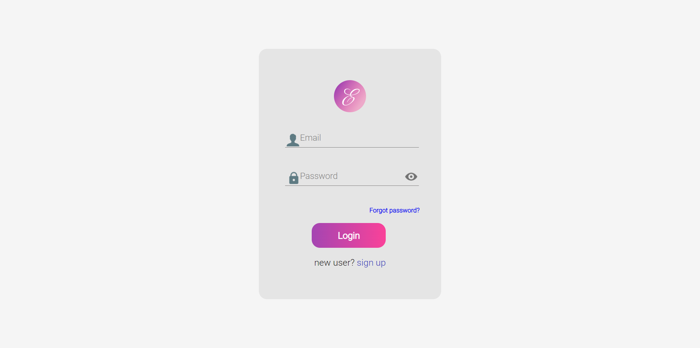
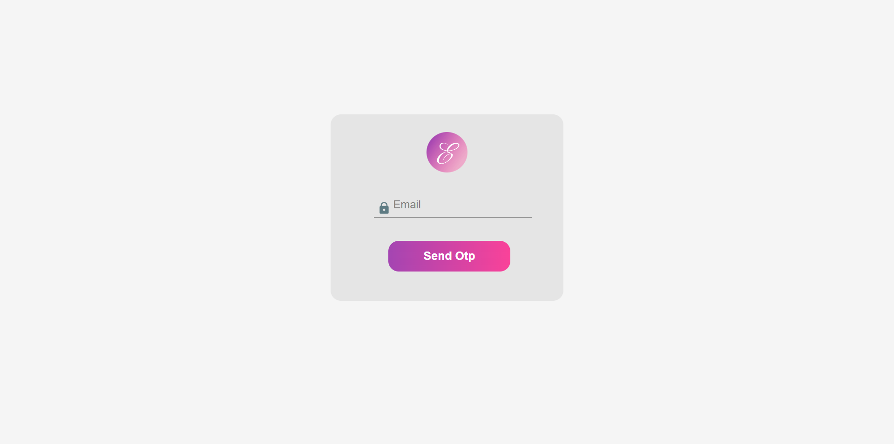
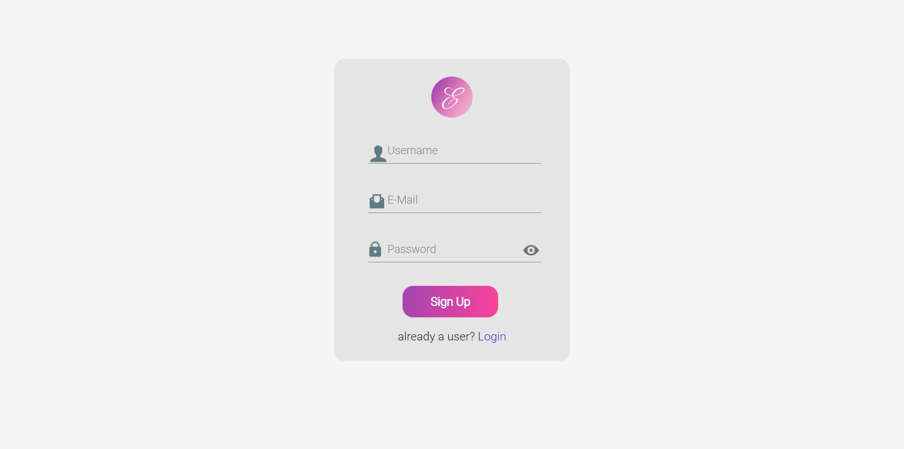
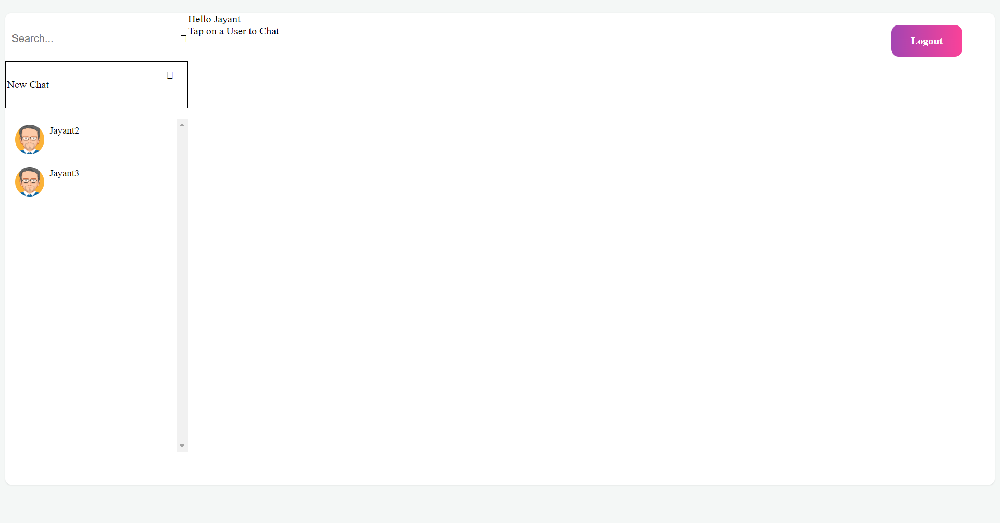
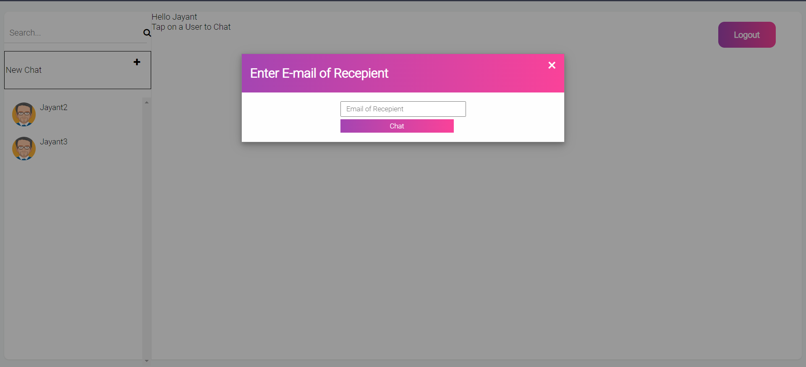
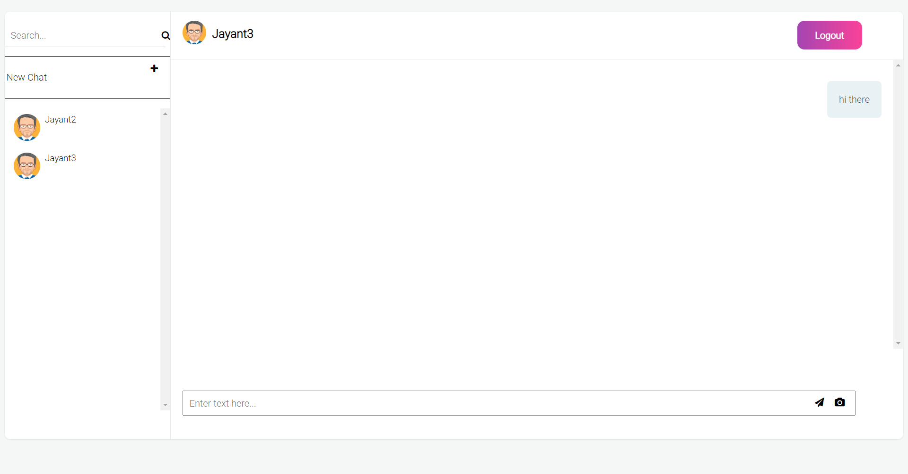
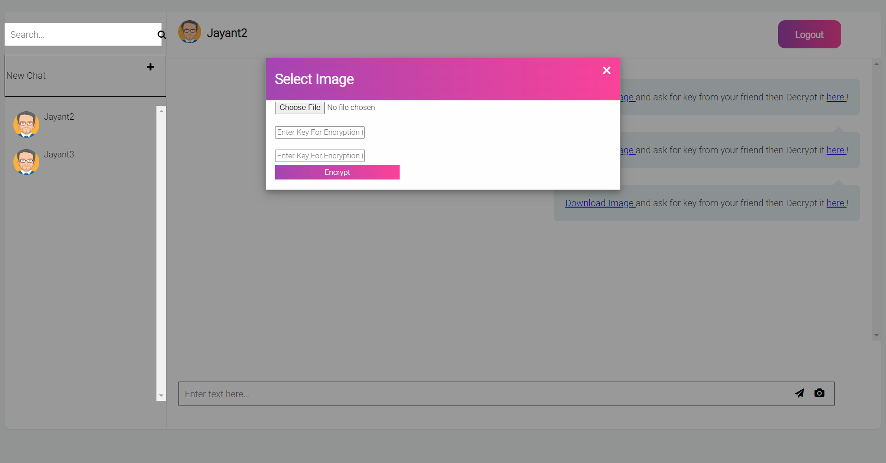
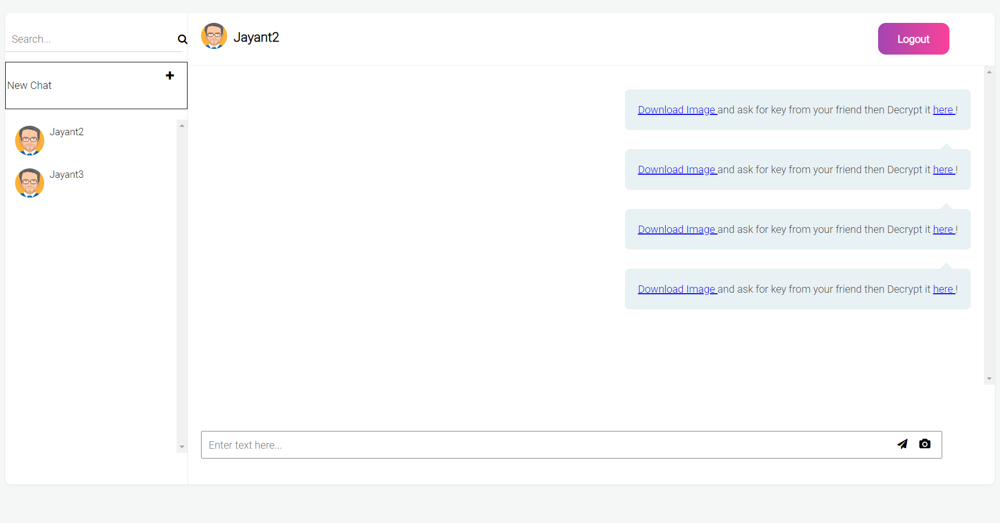
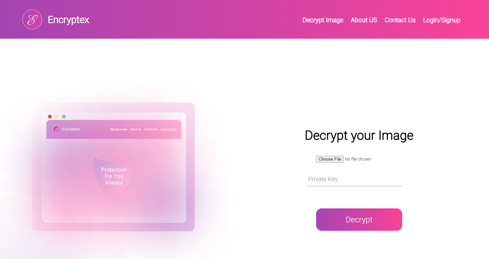

# Encryptex

Encryptex is a simple encryption tool for encrypting and decrypting files while sharing them on a chat platform similar to whatsapp

## Login Page

- The login page is the first page that the user sees when he opens the app. The user can either login or register.

## Forgot Password

- This page is used if a user has forgotten his/her password

## Signup page

- This page is to register a new user

## Dashboard

- After logging in/ signing up user is presented with this page

## New Chat

- This option can be used to start a new chat

## Access old chats

- Here you can access old chats

## Sending new encrypted file

- You can use this option to send an encrypted image

## Sent an encrypted image

- This is how message will be if you send an encrypted image

## Decrypting image

- You use this to decrypt an image

